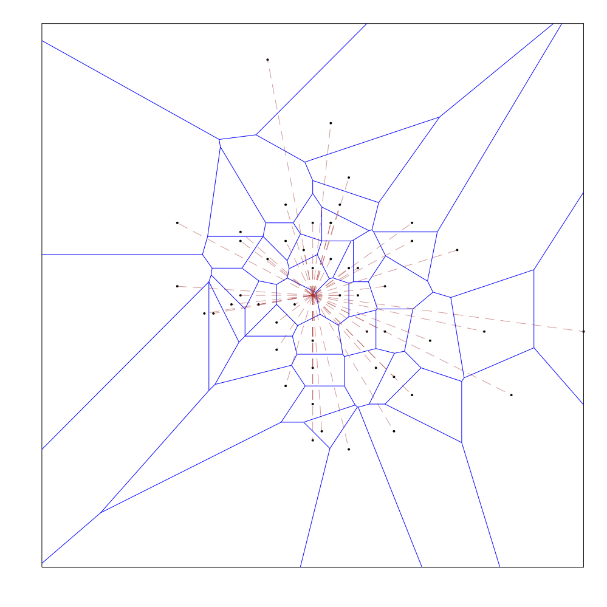
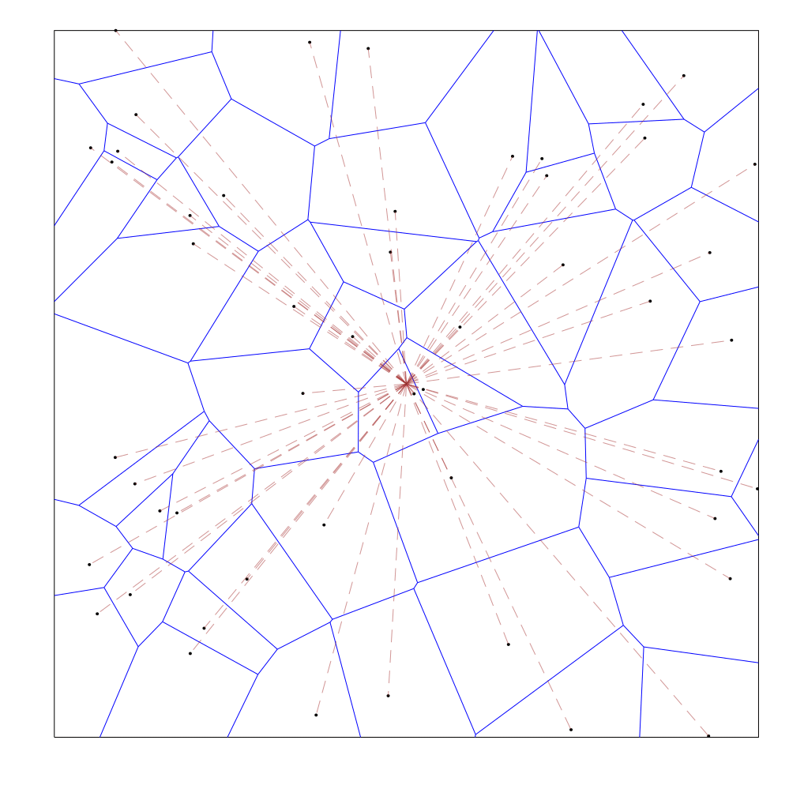
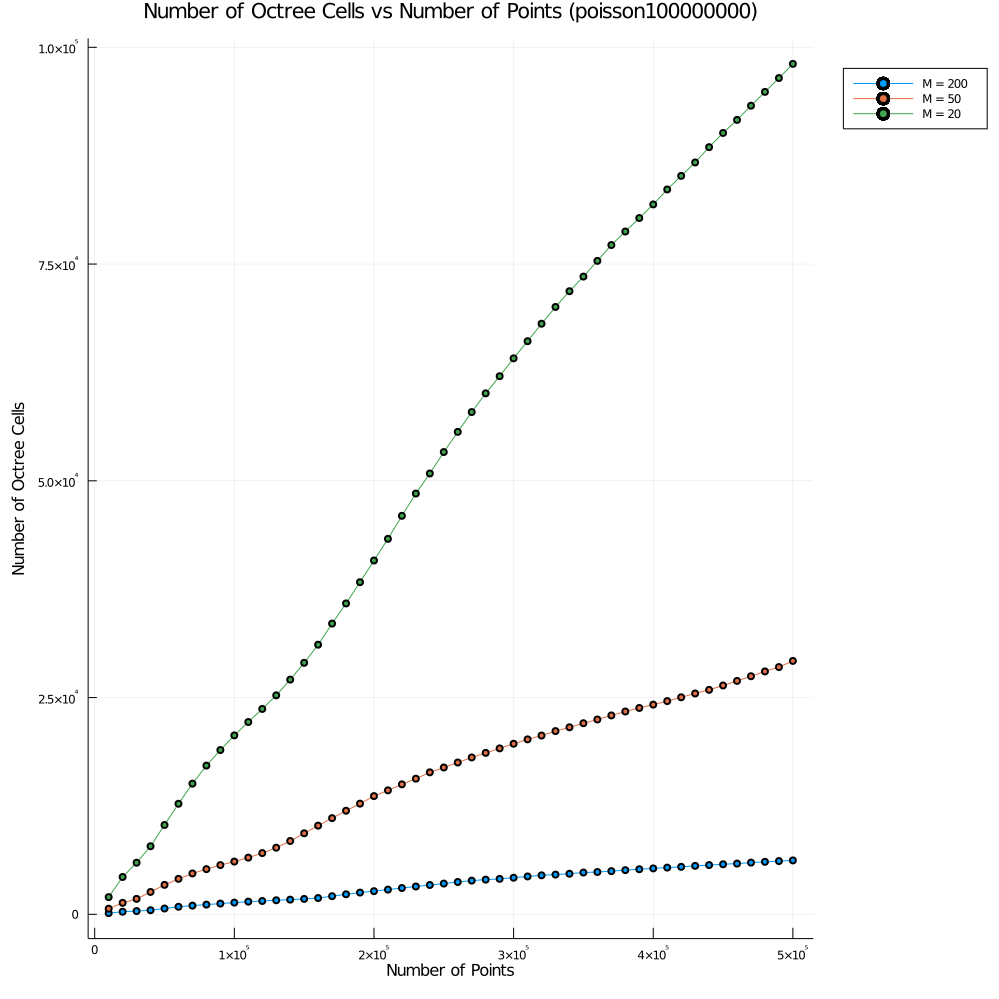
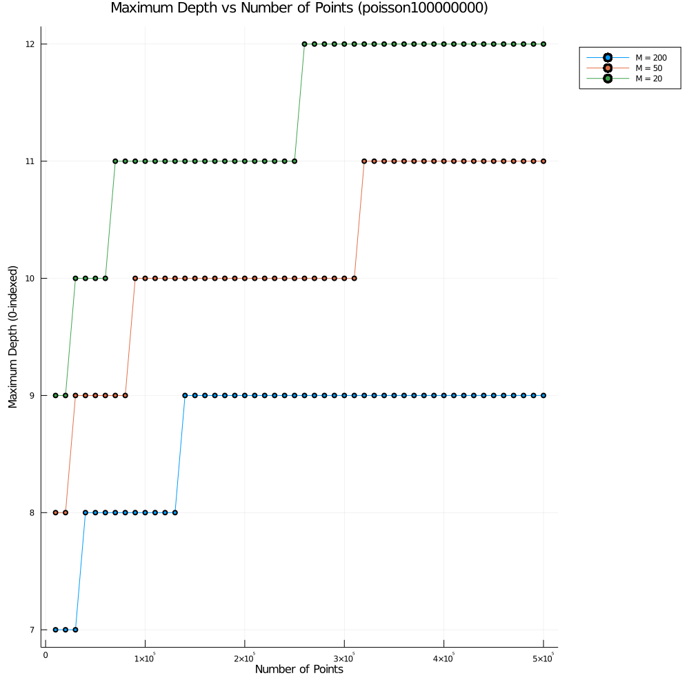
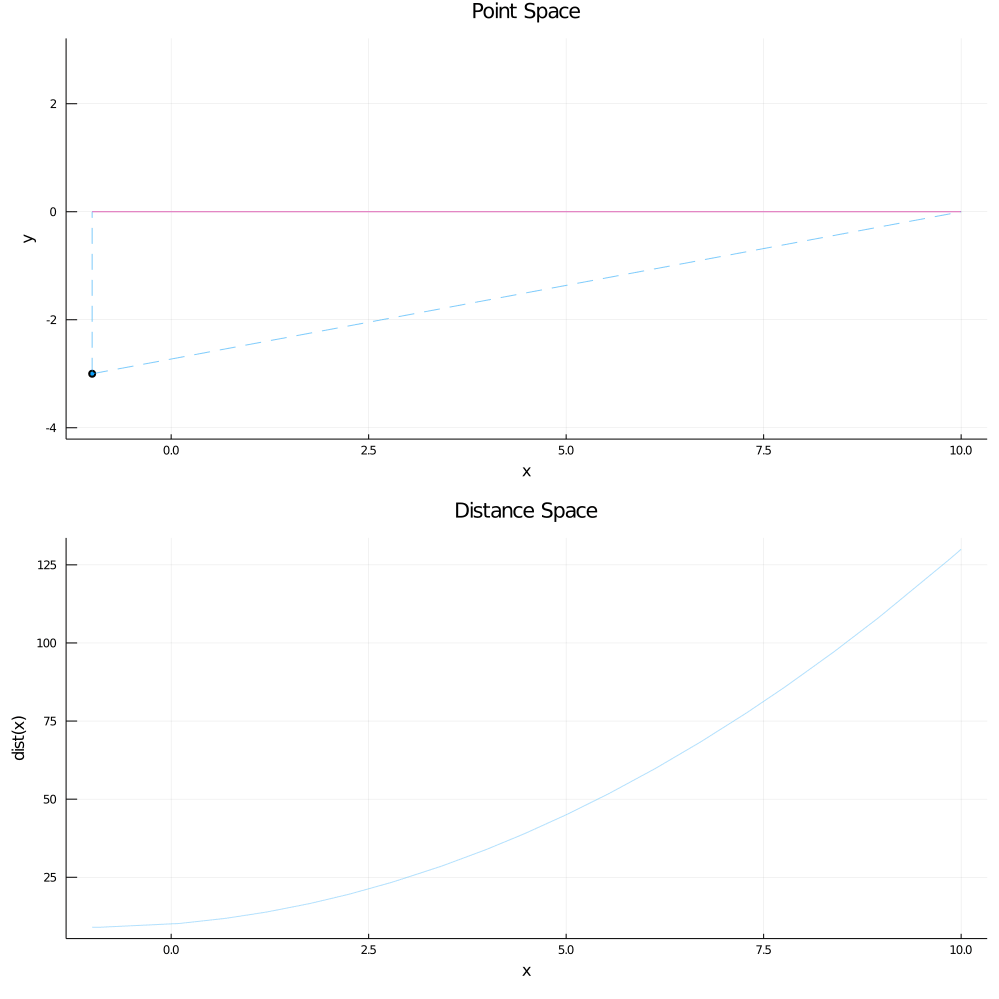
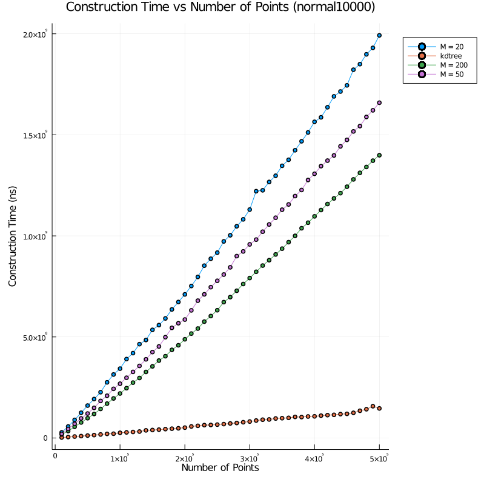
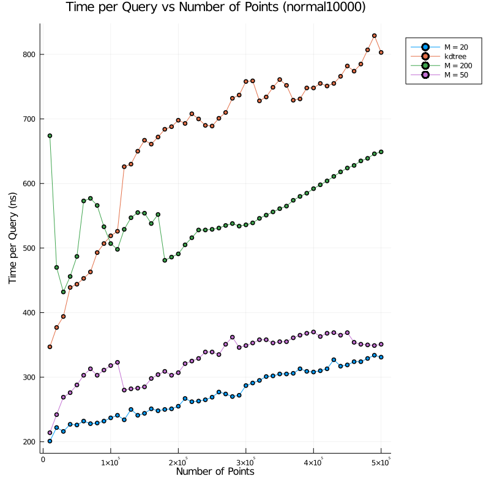

# implicit-octree-nns

This project builds upon the 2D/3D nearest-neighbor data structure described in 
[Almost constant-time 3D nearest-neighbor lookups using implicit octree](https://link.springer.com/article/10.1007/s00138-017-0889-4).

The data structure is implemented in C++, while animations and plots are generated with Julia. 

# Dependencies
* [Catch2](https://github.com/catchorg/Catch2) (only needed for building tests)
* [CGAL](https://www.cgal.org/)
* [CMake](https://cmake.org/)

# Usage
Run the following commands from the root directory of the project:
```bash
mkdir build
cd build
cmake -DCMAKE_BUILD_TYPE={Debug,Release} -DBUILD_TESTS={ON,OFF} -DBUILD_VISUALIZATION={ON,OFF} ..
make
```

CMake must be able to find CGAL, refer to [CGAL Documentation](https://doc.cgal.org/latest/Manual/general_intro.html)
for more information.

Note that building visualizations will slow down program execution tremendously on sets with >= 1000 points.

If you want to generate plots, you will need to modify the [experiments](./src) on the C++ side of things to generate 
data, and then take a look at the scripts in [Runner.jl](./VisualizeImplicitOctree/src) that are used to animate/plot 
this data. Also, note that the julia scripts also produce interactive plots via plotly(), if closer examiniation of the 
data is desired.

## Sketch of Prior Work
### Construction
* Compute the Voronoi diagram of the input point set
* Create an octree on this point set, such that each octree cell overlaps with at most M distinct voronoi cells
* Store all of the octree cells (not just leaves) into a hash table — despite the overlap, there will only be O(n) cells
 for many distributions. See animations/plots below.
 * For each octree leaf, save a list of all points whose voronoi cells intersect with this leaf

The authors introduce an approximate nearest-neighbor variant that uses a similar structure, but achieves
faster construction times since the voronoi diagram does not have to be computed for that version. Refer to Section 5.6 
for more details.

### Query
* Binary search on the depth of the octree leaf that contains the query point
* For a given depth, figure out the position of the octree cell that would contain the query point at this depth if it 
did exist (this can be done since the octree cell boundaries are at regular intervals for each depth)
* If this octree cell does not exist in our hash table, our current depth is too high. On the other hand, if this octree 
cell exists but is not a leaf cell, our current depth is too low. If neither holds, we have the correct depth, and thus
can identify the octree leaf containing the query point
* Iterate through the list of points stored in this octree leaf and find the nearest-neighbor to the query point — this
works in O(M) time, where M is the "max number of overlapping voronoi cells" parameter mentioned in the construction
  
Here are a few brief visualizations of this process, as implemented in this project:

Poisson Distribution:




Uniform Distribution:





The dotted brown lines connect a point to the midpoints of all of the octree cells that its voronoi cell (drawn in blue)
 intersects with. 
 
 During the query process for each query point (draw in pink), the binary search cell is shaded orange if the attempted depth is too shallow (cell exists, but not a
 leaf), red if the attempted depth is too deep (cell doesn't exist), or green if it has found the correct leaf cell.
 
 The same visualization for the normal distribution can be found in 
 [visualize normal distribution]( ./VisualizeImplicitOctree/starred/visualize_normal_distribution.gif).
  
### Pros

* Extremely fast queries: since these run in expected `O(lg(lg(n)))` time for multiple random distributions
* Reasonable construction time for approximate nearest-neighbor queries (~2 mins for ~1e6 points with 60% accuracy), 
with even faster query times
### Cons
* Construction times that are up to two orders of magnitude slower than other nearest-neighbor 
packages (ANN, FLANN, EFANNA) and three orders of magnitude slower than kD trees, despite being parallelized
* Static: adding a point to the data structure requires the whole structure to be recomputed
* Accuracy for approximate nearest-neighbor queries could be improved

## Our Contributions

### Verifying O(n) Cells for Normal/Uniform/Poisson distributions [Mostly Complete]
The maximum depth and number of cells were plotted as a function of the input point set size, here are the results for 
the poisson distribution:








The normal and uniform distrubtion data files can be found at:
 * [normal cell count]( ./VisualizeImplicitOctree/starred/normal_cells.png) 
 * [normal max depth]( ./VisualizeImplicitOctree/starred/normal_depths.png) 
 * [uniform cell count]( ./VisualizeImplicitOctree/starred/uniform_cells.png) 
 * [uniform max depth]( ./VisualizeImplicitOctree/starred/uniform_depths.png) 


Like the prior work, we found a roughly linear number of cells relative to the input size for the uniform and normal
(they call this CLUSTERED) distributions. In addition to this, we also performed the same experiments on the poisson distribution 
and found similar results.

### Improving Construction Time [Complete]
To speed up the process, we can observe that the voronoi diagram of the input point set is not explicitly required when
constructing the octree structure. The only time we need to know information about the voronoi diagram is when we split
 an octree cell into its children. During this splitting process, we need to determine the points whose voronoi cell 
 crosses an octree cell boundary — these are the only points that get copied to child cell(s) that don't directly
 contain the points themselves. Since a point's voronoi cell intersects a line segment (ie. a cell's boundary line)
 iff it is the closest point to some point on the line segment, we just need to find the set of such points. This
 can be done by computing the lower envelope of the 'distance functions' of each point, which is the function that maps
 a position on the line segment to the distance from this point. This can be solved in `O(M)` time where M is the number 
 of points if the equations are pre-sorted by slope, and `O(M lg M)` otherwise.
 
A visualization of the aforementioned process: 

The "Point Space" plot shows the actual points and the horizontal (solid) splitting line at `y = 0`, while the "Distance Space" plot shows
the color-coded distance functions for each point. The dotted lines in the "Point Space" plot signify the range on the split line 
where the point in question is the nearest-neighbor.

This optimization could also be done via lifting maps instead of using the distance functions by hand, but they work out
to be the same process.

In the end, we are able to create the entire octree without having to compute the voronoi diagram for the input point
set. 

### Benchmarking [Partially Complete]

The benchmarks for the normal distribution are: 

 


The other benchmarks for poisson and uniform distributions are located at:
* [poisson construction](./VisualizeImplicitOctree/starred/poission_construction_benchmark.png) 
* [poisson queries](./VisualizeImplicitOctree/starred/poission_queries_benchmark.png) 
* [uniform construction](./VisualizeImplicitOctree/starred/uniform_construction_benchmark.png)
* [uniform queries](./VisualizeImplicitOctree/starred/uniform_queries_benchmark.png) 

Note that in our benchmarks, we try several values for the parameter `M`, as well as compare against a baseline kD tree
implementation that we wrote from scratch. This kD tree was not meant to be especially optimized. Instead, it was mainly
 intended as a sanity check: we expect the kD tree to have a much lower construction time while also having a much higher
 query time relative to the octree nearest neighbor; this was demonstrated in the prior work. This turned out to hold true
 for us too, except for the case where our `M = 200` octree was slower than the kD tree at answering queries. This
 is likely because the benefit of having a slightly smaller depth does not compensate for the large number of operations
 required to narrow down the nearest neighbor candidate in a octree leaf overlapping with 200 voronoi cells  (since the 
 octree depth would be relatively low for a uniformly distributed point set, regardless of what `M` is set to). 

The query benchmarks in this project are slightly faster than those of the prior work, but this is likely due to their
benchmarks being for 3D nearest neighbor queries, and differences in hardware. On the other hand, the construction time 
seems to have improved when comparing the results for the normal (ie. CLUSTERED) distribution, which is the 
only synthetic distribution for which they provided a plot of construction times (note that the prior work separated out
the voronoi precomputation time out of their construction time in Fig 6). 

Regardless, more accurate analysis/comparisons should be undertaken before making stronger conclusions. This can be done
via comparisons against the nearest-neighbor projects benchmarked in the prior work, as their own code is private.


## Incremental Point Insertion [WIP]
To insert points incrementally, one can first insert the point P into the octree leaf that contains it via the 
query operation described above, since we know the voronoi cell for P MUST intersect with the leaf at some point. Now,
all that is left to do is to dfs out of this node and continue flood-filling across cell boundaries iff P's voronoi
cell intersects the octree cell boundary. This can be checked much like before, but there are a few complications.

First, finding a cell's 'neighbor' can be non-trivial from an implementation perspective since cells can have different
depths at various points of the construction. 

Additionally, this incremental procedure might create leaves that would otherwise not have existed in the prior 
construction of the octree. This can happen when a newly inserted point in the octree
ends up making several other points redundant, by being closer to a large set of octree cells than all of these
previously inserted points. Potentially, this might mean that some prior cell splits were unnecessary, which could
lead to a difference in output octrees. On the plus side, this can never be harmful from a correctness perspective; 
there might be redundant cells, but every necessary cell is still contained in this construction. Therefore, if (and 
this is a big if) we can experimentally or theoretically verify that there aren't 'too many' redundant cells and that a 
cell will never have too many neighbors (which seems plausible if we randomly permute the input sequence), this incremental
 process might achieve an average-case construction time of `O(n lg lg n)`, since all of the `find` queries
take `O(lg lg n)` each, and the remaining flood-fill portion could potentially run in `O(n)` (amortized) time, assuming
that the total number of cells ends up being `O(n)`.

## Improved Approximate Nearest-Neighbor Accuracy [WIP]
The approximate nearest-neighbor scheme in the prior work is very coarse-grained: a range of depths was chosen a priori,
and each point was stored in octree cells in a small neighborhood around the point at those predetermined depths. This 
approach did not utilize voronoi cells at all, which is a potential avenue for improvement. Taking inspiration from the
incremental idea in the previous section, we could first insert points at the leaf cell containing them,
then replace the flood-fill step with the prior work's approximation scheme -- with the key difference being that
we split our cells according to the implicit voronoi cells. This hybrid scheme avoids a lot of implementation
complexity while still taking advantage of voronoi cell information, which could hopefully lead to a good balance 
between construction speed and accuracy.

## Next Steps & Current Limitations
* Benchmarking against EFAANA/FLANN/ANN should be done to not only compare against other nearest-neighbor 
implementations but also to compare against the prior work by proxy, particularly the construction times.

* Currently the data structure can only be constructed in 2D. Extending the data structure to 3D should not be too hard,
 as almost everything is templated on the dimension. However, a 3D convex hull implementation, either
 from CGAL or hand-written, is going to be needed to compute the octree splitting operation.
 
* Implementing the incremental point insertion would be useful to verify if it leads to any 
improvements.
    * Similarly, the hybrid approximate nearest neighbor idea would also be interesting to experiment with.

* See how well a heavily-parallelized (maybe GPU) version of this project would do
